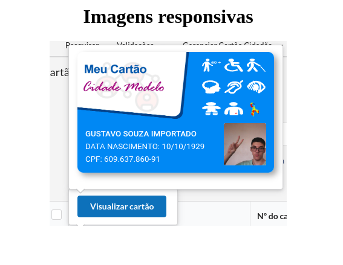
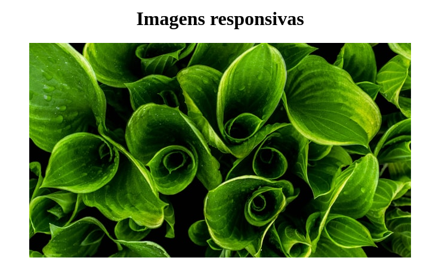
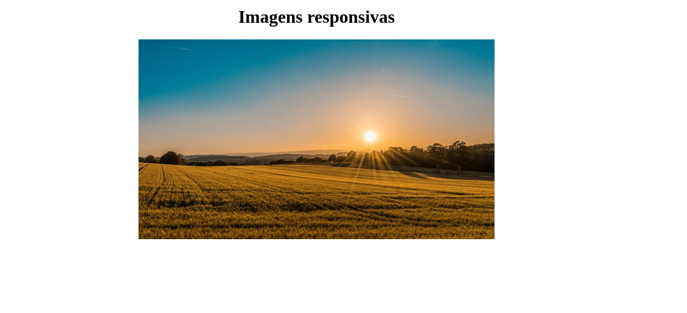

# Responsividade com CSS

## Imagens responsivas

A propriedade **picture** permite definir qual imagem dentro de um grupo de imagens será exibida em tela, dependendo de algum fator, como por exemplo o tamanho da tela.
Dentro da tag **picture** é possível utilizar várias tags **source** definindo a imagem que deverá ser exibida e a condição em que ela deve ser exibida.
No final pode ser utilizada uma tag **img** comum para definir uma imagem padrão.

Exemplo:
```html
<!DOCTYPE html>

<html lang="pt-BR">
	<head>
		<meta charset="UTF-8">
		<meta name="viewport" content="width=device-width, initial-scale=1.0">
		<title>Imagens responsivas</title>
		<link rel="stylesheet" href="styles.css">
	</head>
	<body>
		<h1>Imagens responsivas</h1>
		<div class="images">
			<picture>
				<source media="(min-width: 850px)" srcset="images/img1.jpg">
				<source media="(min-width: 650px)" srcset="images/img2.jpg">
				
			</picture>
		</div>
	</body>
</html>
```

#### Resultados:

Resolução com tamanho inferior a 650px:


Resolução com tamanho igual ou superior a 650px e menor que 850px:


Resolução igual ou maior que 850px:


## Propriedade object-fit

A propriedade **object-fit** permite ajustar uma imagem de acordo com o tamanho disponível para ela. Seus principais valores são:
- **fill** (padrão): Ocupa todo o espaço disponível, mesmo que a imagem acabe ficando desproporcional e distorcida;
- **contain**: Irá dimensionar a imagem de acordo com a largura disponível, porém mantendo a altura proporcional para que a imagem não fique distorcida;
- **cover**: Irá cortar parte da imagem para ocupar todo o espaço disponível, mas para que a imagem não fique distorcida

## Media queries

A propriedade **@media** permite adicionar estilos quando uma determinada condição é atingida, geralmente relacionada ao tamanho da tela. Isso a torna uma propriedade muito útil para tornar páginas responsividade.

### max-width e min-width

Exemplo:
```css
h1 {
    text-align: center;
}

@media screen and (max-width: 600px) {
    h1 {
        color: white;
    }

    body {
        background-color: black;
    }
}
```

Nesse exemplo, as alterações de cores no **h1** e no **body** são aplicadas somente quando o tamanho da tela for igual ou inferior a 600px.

### only print

Quando é adicionada a condição **only print**, os estilos só são aplicados na impressão da página.

Exemplo:
```css
h1 {
    text-align: center;
}

@media only print {
    body {
        background-color: black;
    }
}
```

Nesse exemplo, o fundo fica na cor preta apenas na impressão da página.

### orientation

Aplica os estilos de acordo com determinada orientação, **landscape** (paisagem) ou **portrait** (retrato).

Exemplo:
```css
h1 {
    text-align: center;
}

.container {
    display: flex;
}

.box {
    height: 100px;
    width: 100px;
    border: 2px solid black;
}

@media (orientation: landscape) { /* Aplica quando a orientação for paisagem */
    .container {
        flex-direction: row;
    }
}

@media (orientation: portrait) { /* Aplica quando a orientação for retrato */
    .container {
        flex-direction: column;
    }
}
```

### aspect-ratio

Aplica os estilos de acordo com a proporção da tela.
**Sintaxe**: `@media (aspect-ratio: altura/largura)`

Exemplo:
```css
h1 {
    text-align: center;
}

@media (aspect-ratio: 16/9) {
    body {
        background-color: blueviolet;
    }
}

@media (aspect-ratio: 1/1) {
    body {
        background-color: cyan;
    }
}

@media (aspect-ratio: 1/2) {
    body {
        background-color: pink;
    }
}
```

## Variáveis

Assim como em uma linguagem de programação, no CSS também é possível criar variáveis. Para se declarar uma variável no CSS, usa-se os caracteres `--` antes do nome da variável, exemplo `--bg-color`. 

A variável criada poderá ser acessada dentro do bloco onde ela foi declarada e também nos blocos correspondentes a elementos "filhos" do bloco do elemento onde a variável foi criada. Por conta disso, é bem comum declarar variáveis dentro do bloco `:root {}` para que sejam acessíveis em qualquer outro bloco.

Para acessar o conteúdo de uma variável, é utilizada a função `var()` passando como parâmetro o nome da variável, por exemplo: `var(--bg-color)`.

É possível passar qualquer conteúdo para variáveis, como cores, fontes, tamanhos, entre outros valores.

Exemplo:
```css
:root {
    --bg-color: #000;
    --bg-secondary: #444;
    --font-color: rgb(72, 72, 201);
    --font-secondary: #fff;
}

h1 {
    text-align: center;
    color: var(--font-secondary);
}

body {
    background-color: var(--bg-color);
    color: var(--font-color);
    font-family: 'Courier New', Courier, monospace;
}
```

É possível passar mais de um parâmetro para a função `var()` para o caso de o primeiro parâmetro passado não seja uma variável existente, nesse caso a função irá aplicar o valor da próxima variável passada como parâmetro.

Exemplo:
```css
:root {
    --bg-color: #000;
    --bg-secondary: #444;
    --font-color: rgb(72, 72, 201);
    --font-secondary: #fff;
}

h2 {
    text-align: center;
    color: var(--variavel-inexistente, #fff);
}
```

### Uso de variáveis em media queries

Uma ótima utilidade para as variáveis são na criação de medias queries, por exemplo: em determinadas resoluções de telas, o valor de uma variável que armazena o tamanho de uma fonte poderá ser alterado e assim irá afetar todos os locais onde essa variável é utilizada de uma só vez.

Exemplo:
```css
:root {
    --bg-color: rgb(16, 16, 80);
    --font-color: #fff;
    --font-size: 18px;
    --font-title: 50px;
}

h1.title {
    text-align: center;
    font-size: var(--font-title);
    color: var(--font-color);
}

body {
    background-color: var(--bg-color);
    color: var(--font-color);
    font-family: 'Courier New', Courier, monospace;
    font-size: var(--font-size);
}

/* Modifica o valor das variáveis caso a resolução seja menor que 600px */
@media screen and (max-width: 600px) {
    :root {
        --font-title: 25px;
        --font-size: 12px;
    }
}
```

## Estratégia para deixar altura relativa à largura

Uma forma para se deixar um elemento, como imagem ou vídeo, com altura sempre relativa à largura é que esse elemento seja formado por 3 tags aninhadas. Abaixo foi utilizado um iframe de vídeo como exemplo:
```html
<div class="video">
	<div class="video-area">
		<iframe 
			src="https://www.youtube.com/embed/wy_fSStEg"
			frameborder="0" 
			allowfullscreen
		>
		</iframe>
	</div>
</div>
```

Na estilização do elemento, na primeira `div` deve ser informada à largura que o vídeo ou elemento em questão deve possuir.

Exemplo:
```css
.video {
    width: 60%;
}

.video-area {
    position: relative;
    height: 0;
    padding: 0 0 56.25%;
}

.video-area iframe {
    position: absolute;
    top: 0;
    bottom: 0;
    left: 0;
    width: 100%;
    height: 100%;
    border: 0px;
}
```

### Min-max

A função `max` compara dois valores e aplica o maior valor, já a função `min` faz o inverso. São funções bem úteis para realizar uma comparação entre duas medidas relativas, ou uma medida fixa com uma medida relativa.

Exemplo:
```css
.image {
    width: max(60%, 500px);
}

.image-area {
    position: relative;
    height: 0;
    padding: 0 0 56.25%;
}

.image-area img {
    position: absolute;
    top: 0;
    bottom: 0;
    left: 0;
    width: 100%;
    height: 100%;
    border: 0px;
}
```

### Calc

A função `calc()` permite realizar cálculos entre medidas relativas e medidas fixas.

Exemplo:
```css
.image {
    width: calc(60% - 100px);
}

.image-area {
    position: relative;
    height: 0;
    padding: 0 0 56.25%;
}

.image-area img {
    position: absolute;
    top: 0;
    bottom: 0;
    left: 0;
    width: 100%;
    height: 100%;
    border: 0px;
}
```